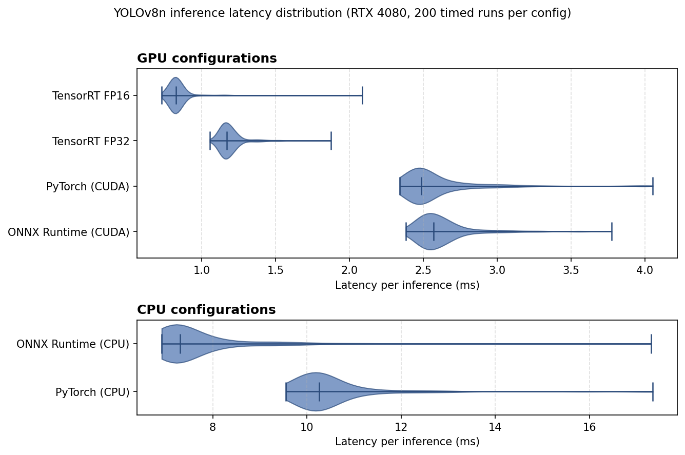

# trtbench

Benchmarking YOLOv8n object detection across PyTorch, ONNX Runtime, and TensorRT on consumer NVIDIA hardware.

This project builds a deployment pipeline for a pretrained real-time object detector and quantifies its inference performance across three runtimes spanning the eager-execution-to-ahead-of-time-compilation spectrum. Each runtime executes the same model on the same hardware and the same fixed input; only the execution strategy differs. The benchmark uses warmup runs, explicit CUDA synchronization, and reports p50/p95/p99 latencies over 200 timed iterations per configuration. The headline result: TensorRT FP16 reaches **1211 fps with a p99 latency of 1.15 ms** on an RTX 4080, a 3.0x throughput improvement over PyTorch eager-mode CUDA on identical inputs.

## Headline results

All measurements on an RTX 4080 (Ada Lovelace, 16 GB), Windows 11, with YOLOv8n at 640×640 input resolution and batch size 1. Each row is 200 timed iterations after 20 warmup iterations, with explicit CUDA synchronization around the timed region. Times are pure model forward pass, exclusive of preprocessing and NMS postprocessing.

| Runtime | Precision | p50 (ms) | p95 (ms) | p99 (ms) | Throughput (fps) | Speedup vs PyTorch CUDA |
|---|---|---|---|---|---|---|
| TensorRT (CUDA) | FP16 | 0.83 | 0.90 | 1.15 | 1211 | **3.01×** |
| TensorRT (CUDA) | FP32 | 1.17 | 1.38 | 1.54 | 854 | 2.12× |
| PyTorch (CUDA) | FP32 | 2.49 | 3.05 | 3.97 | 402 | 1.00× |
| ONNX Runtime (CUDA) | FP32 | 2.57 | 3.01 | 3.53 | 389 | 0.97× |
| ONNX Runtime (CPU) | FP32 | 7.31 | 9.58 | 11.28 | 137 | 0.34× |
| PyTorch (CPU) | FP32 | 10.26 | 12.22 | 15.90 | 97 | 0.24× |



The progression top-to-bottom matches the spectrum the project set out to measure. PyTorch eager mode and ONNX Runtime perform within 3% of each other on CUDA — both leave Python interpreter overhead behind, but neither applies whole-program compilation. The 2.1× jump to TensorRT FP32 is the cost of moving from load-time graph optimization to ahead-of-time kernel compilation against the specific GPU architecture, visible in the chart as both faster medians *and* substantially tighter distributions: TensorRT picks one optimal kernel implementation at build time, so every inference runs the same code path. The further 1.4× to TensorRT FP16 is the Tensor Core dividend on Ada Lovelace — the same compiled engine, re-emitted in reduced precision, dispatched to dedicated hardware. On CPU, ONNX Runtime beats PyTorch eager by 1.4×, the only configuration where the two diverge meaningfully, with both showing long right tails characteristic of CPU scheduling jitter on Windows.

## Methodology

### Benchmark protocol

Each configuration is benchmarked with the same procedure to make the results directly comparable across runtimes.

**What's measured.** The timing window contains only the model forward pass on a tensor that already lives on the target device. Input preparation (host-to-device transfer, dtype casting for FP16 engines) is done once before the timing loop. Postprocessing — non-maximum suppression, box decoding, label assignment — is excluded entirely. This isolates what the runtimes actually do differently. End-to-end pipeline performance is a separate concern, dominated in this configuration by NMS rather than by the model itself.

**Warmup.** Each configuration runs 20 untimed iterations before timing begins. First inferences are unrepresentative: cuDNN autotuners select kernels on first call, GPU clocks ramp from idle, lazy initialization paths execute, and any JIT compilation happens. Including these in the measured distribution would bias the mean upward and inflate the apparent tail. Twenty iterations is enough for all of the above to settle on this hardware; the warmup loop is invariant across runtimes.

**GPU synchronization.** For CUDA backends, `torch.cuda.synchronize()` is called immediately before reading the start time and again before reading the end time. CUDA kernel launches are asynchronous: a naive `time.perf_counter()` call around `model(x)` measures only the launch overhead, not the actual GPU work. The TensorRT backend uses an explicit CUDA stream and synchronizes on the stream rather than the global context, which is the correct primitive for stream-bound execution.

**Sample size.** Each timed measurement is the median (p50) and tail (p95, p99) over 200 iterations. The mean alone is uninformative for distributions with long right tails — which most inference workloads have, as the latency distribution panel shows. p99 specifically is the metric production systems care about, because tail latencies dominate user-visible behavior and SLA compliance.

**Fixed input.** All configurations evaluate the same NumPy tensor — shape (1, 3, 640, 640), seeded random values, FP32 source — generated once per run. The TensorRT FP16 backend casts to FP16 inside its input-preparation step, outside the timing window. This ensures any performance difference reflects the runtime, not the input.

**Configuration metadata.** Each results file includes a `system` block recording the PyTorch version, CUDA version, ONNX Runtime version, TensorRT version, GPU device, OS, and a UTC timestamp. This is the record of what software actually ran when the data was collected, and it is what makes the benchmark reproducible after the fact.

### Verifying runtime parity

Before benchmarking, the ONNX export was verified to produce numerically equivalent outputs to the source PyTorch model. The parity check compares both raw output tensors and final detections (post-NMS) on a set of test inputs; differences fall within floating-point tolerance (~1e-4 on raw outputs, identical detections at standard confidence thresholds).

The TensorRT engines were validated functionally rather than numerically: both the FP32 and FP16 engines produce identical detection results (persons and bus counts) to the PyTorch reference on the Ultralytics sample image. Strict numerical parity between PyTorch and TensorRT FP32 is a reasonable extension and is noted in [Future work](#future-work).

### Software stack

Windows benchmark results in this README were collected in a single session under the following stack:

| Component | Version |
|---|---|
| OS | Windows 11 (build 26200) |
| Python | 3.12.5 |
| PyTorch | 2.12.0+cu126 |
| ONNX Runtime | 1.26.0 (CUDA execution provider) |
| TensorRT | 10.16.1.11 |
| NVIDIA driver | 596.49 |
| Ultralytics | 8.4.51 |

macOS results were collected on a separate machine running Python 3.14.3 with PyTorch 2.12.0 (MPS backend) and ONNX Runtime 1.26.0 (CPU execution provider). Full system metadata is captured inline in each results JSON file under the `system` key.

### Hardware

**Windows (primary benchmark target):** NVIDIA RTX 4080 (Ada Lovelace, 16 GB VRAM), AMD Ryzen 7 9800X3D, Windows 11. This is the configuration the TensorRT engines were built and tuned for.

**macOS (cross-platform baseline):** MacBook Air M2 (8-core CPU, 8-core GPU), used for CPU and MPS results. TensorRT is NVIDIA-only and is not available on this machine.

## What's in this repo

```
detect_live.py          Live PyTorch inference on webcam or video with FPS overlay
export_onnx.py          Export YOLOv8n PyTorch weights to ONNX
export_trt.py           Build FP32 and FP16 TensorRT engines from the ONNX model
parity_check.py         Verify ONNX Runtime outputs match PyTorch within tolerance
bench.py                Benchmark harness: warmup, sync, p50/p95/p99 across runtimes
make_table.py           Combine per-machine results JSONs into a unified comparison table
make_chart.py           Render two-panel latency distribution chart from a results JSON
```

Results from the benchmark runs live in `results_win.json` and `results_mac.json`. Both files include a `system` block with the full software stack used to collect that data.

## Reproducing the results

### Install

Clone the repository and create a virtual environment:

```bash
git clone https://github.com/senorkey/trtbench.git
cd trtbench
python -m venv .venv
source .venv/bin/activate              # Windows: .venv\Scripts\activate
pip install -r requirements.txt
```

For CUDA acceleration on Windows or Linux, install PyTorch from the PyTorch index *before* (or *separately from*) installing other packages, because the CUDA wheels are not on PyPI:

```bash
pip install torch torchvision --index-url https://download.pytorch.org/whl/cu126
```

For TensorRT (Windows or Linux with NVIDIA GPU):

```bash
pip install tensorrt
```

> **Gotcha:** Installing `tensorrt` after a CUDA-enabled PyTorch can silently replace `torch` with the CPU-only PyPI wheel. If `torch.cuda.is_available()` returns `False` after a TensorRT install, reinstall PyTorch from the CUDA index URL above. The metadata block in `bench.py`'s output makes this kind of regression visible after the fact.

### Export the model artifacts

The benchmark needs three model files: the original PyTorch weights, an ONNX export, and (for GPU machines) two TensorRT engines.

```bash
# ONNX export from yolov8n.pt
python export_onnx.py

# TensorRT engines (Windows/Linux + NVIDIA GPU only)
python export_trt.py
```

The PyTorch weights (`yolov8n.pt`) are downloaded automatically by Ultralytics on first use. TensorRT engines are GPU-architecture-specific and tuned for the build host; the engines in this repository's results were built on an RTX 4080 and would need to be rebuilt for other GPU families.

### Run the benchmark

```bash
# Everything available on this machine:
python bench.py --out results.json

# Restrict to one runtime / device / precision:
python bench.py --backend tensorrt --variant fp16 --out results.json
```

The harness automatically detects which configurations can run on the current machine (PyTorch CPU/CUDA/MPS, ONNX Runtime CPU/CUDA, TensorRT FP32/FP16) and skips the rest. Each timed configuration takes about ten seconds; the full six-configuration sweep on the RTX 4080 takes roughly a minute.

To combine results across machines and render the comparison table and chart:

```bash
python make_table.py results_win.json results_mac.json
python make_chart.py results_win.json --out latency_distributions.png
```

## Scope and limitations

This project benchmarks **single-image inference latency at fixed input resolution on consumer hardware.** Specifically out of scope:

- **No model training.** Uses pretrained Ultralytics YOLOv8n COCO weights unchanged. The focus is the deployment and benchmarking pipeline, not model accuracy or task-specific fine-tuning.
- **Batch size 1 only.** Throughput would scale differently with larger batches; multi-batch behavior is a separate measurement.
- **Single input resolution (640×640).** Different resolutions trade accuracy for speed and would produce a different comparison.
- **No INT8 quantization benchmark.** INT8 with proper calibration is a natural next step but requires a calibration dataset and a numerical-accuracy delta measurement to be defensible. Listed in Future work.
- **No edge or embedded benchmarks.** All results are on x86 desktop hardware. Jetson and similar embedded NVIDIA targets are out of scope.
- **Pure model inference, not end-to-end pipeline.** Preprocessing and postprocessing (NMS) are excluded from timing. End-to-end pipeline throughput in a real application is bounded by these stages and would not match the raw inference numbers reported here.

## Future work

- **TensorRT INT8 quantization** with calibration on a COCO subset, plus measured accuracy delta on a validation set
- **Numerical parity check between TensorRT FP32 engine and PyTorch source model** (currently verified only functionally via identical detection counts on sample images)
- **Edge GPU benchmark on Jetson Orin Nano** to extend the runtime spectrum to embedded NVIDIA hardware
- **End-to-end pipeline benchmark** including preprocessing and NMS, with GPU NMS kernels where the runtime supports them
- **Multi-batch throughput measurement** to characterize how the inference-per-image cost scales with batch size on each runtime
- **Domain-specific fine-tuning** on a representative dataset, to extend the project from "deployment pipeline for a stock model" to "deployment pipeline for a trained model"